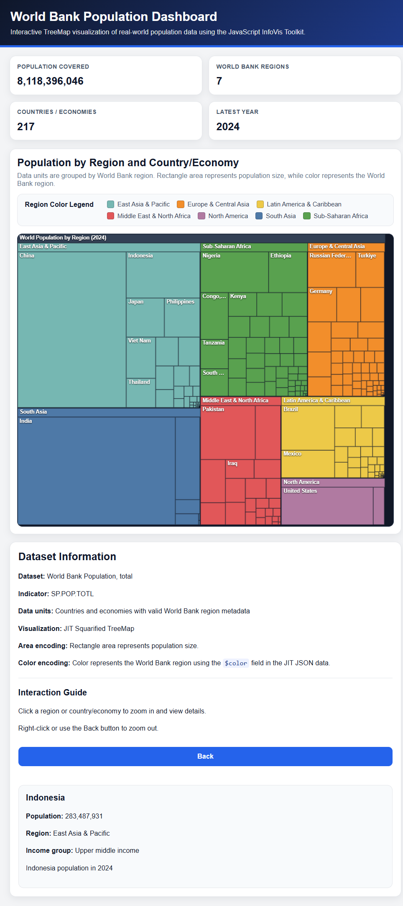

# World Bank Population Dashboard using JIT

This project visualizes a real-world **World Bank Population, total** dataset using the **JavaScript InfoVis Toolkit (JIT)** TreeMap visualization.

The dashboard converts the original World Bank CSV dataset into a JIT-compatible hierarchical JSON structure and displays population data by **World Bank region** and **country/economy**.

---

## Project Overview

The purpose of this project is to demonstrate how a real-world dataset can be transformed into JSON format and visualized using the JavaScript InfoVis Toolkit.

The dashboard includes:

- A real-world World Bank population dataset
- JIT-compatible hierarchical JSON data
- Interactive TreeMap visualization
- Region-based color legend
- Year-based population selection
- Multiple JIT TreeMap display modes
- Tooltip and details panel
- Responsive dashboard layout

---

## Dataset

**Dataset:** World Bank Population, total  
**Indicator:** SP.POP.TOTL  
**Source format:** CSV  
**Visualization format:** JIT-compatible JSON  
**Data units:** Countries and economies with valid World Bank region metadata  

The original World Bank dataset contains population values for multiple years. The Python conversion script processes these CSV files and generates a hierarchical `data.json` file.

---

## Visualization Tool

This project uses the **JavaScript InfoVis Toolkit (JIT)**.

The main visualization is based on:

```javascript
new $jit.TM.Squarified(...)
```

The TreeMap is rendered using JIT and populated using:

```javascript
tm.loadJSON(json)
tm.refresh()
```

---

## TreeMap Modes

The dashboard allows users to switch between different JIT TreeMap display modes:

1. **Squarified Animated TreeMap**  
   Displays the complete hierarchical dataset using JIT Squarified TreeMap animation.

2. **On-Demand Nodes TreeMap**  
   Starts with higher-level nodes and loads child nodes using JIT request and prune logic.

3. **Cushion TreeMap**  
   Uses JIT Cushion TreeMap rendering with a gradient-based depth effect.

These options allow the user to explore different TreeMap styles while using the same World Bank population dataset.

---

## Year Selection Feature

The dashboard includes a year input option where users can enter the population year they want to visualize.

The available year range is displayed on the dashboard so users do not enter a year that is not present in the dataset.

Example:

```text
Available year range: 1960 to 2024
```

If the user enters a valid year, the TreeMap is rebuilt using population values from that year.

If the user enters an unavailable year, an error message is shown.

---

## Visual Encoding

The TreeMap uses the following visual encoding:

- **Rectangle area:** Represents population size.
- **Color hue:** Represents the World Bank region.
- **Shade intensity:** Helps distinguish population magnitude within the selected year.
- **Tooltip/details panel:** Shows population, region, and income group information.

Small country/economy labels are intentionally hidden when rectangles are too small. Users can hover over or zoom into regions to inspect smaller countries/economies.

---

## Dashboard Features

The dashboard includes:

- **Header banner** with project title and description
- **Summary cards** showing:
  - Population covered
  - World Bank regions
  - Countries/economies
  - Selected year
- **Dataset information panel**
- **Year input control**
- **TreeMap mode selector**
- **Region color legend**
- **Interactive TreeMap**
- **Tooltip and details panel**
- **Responsive layout for different screen sizes**

---

## Project Folder Structure

```text
worldbank_jit_dashboard_final/
│
├── index.html
├── data.json
├── convert_to_jit_json.py
├── README.md
│
├── css/
│   └── style.css
│
├── js/
│   ├── jit.js
│   ├── jit-yc.js
│   └── app.js
│
├── raw_data/
│   ├── API_SP.POP.TOTL_DS2_en_csv_v2_259579.csv
│   ├── Metadata_Country_API_SP.POP.TOTL_DS2_en_csv_v2_259579.csv
│   └── Metadata_Indicator_API_SP.POP.TOTL_DS2_en_csv_v2_259579.csv
│
└── screenshots/
    └── dashboard.png
```

---

## How to Run

### 1. Install pandas

If pandas is not already installed, run:

```bash
pip install pandas
```

### 2. Generate the JIT-compatible JSON file

Run:

```bash
python convert_to_jit_json.py
```

This creates or updates:

```text
data.json
```

### 3. Start a local server

Run:

```bash
python -m http.server 8000
```

### 4. Open the dashboard

Open this URL in your browser:

```text
http://localhost:8000
```

If the browser shows an old version, use:

```text
Ctrl + Shift + R
```

or clear the browser cache.

---

## Data Processing Output

The conversion script generates output similar to:

```text
Default/latest year selected: 2024
JIT-compatible JSON saved as: data.json
Total countries/economies included: 217
Total regions included: 7
Available years included: 1960 to 2024
```

The actual values may slightly vary depending on the World Bank dataset version.

---

## Explanation of JSON Structure

The generated `data.json` follows the hierarchical format required by JIT TreeMap.

The hierarchy is:

```text
Root
└── World Bank Region
    └── Country/Economy
```

Each node contains:

- `id`: Unique node identifier
- `name`: Display name
- `data`: Data attributes used by JIT
- `children`: Child nodes

Important JIT fields include:

```json
"$area"
```

This controls the rectangle size.

```json
"$color"
```

This controls the rectangle color.

The project also stores population values for multiple years so the dashboard can rebuild the TreeMap when a user selects a different year.

---

## Interaction Guide

- Hover over a rectangle to view a tooltip.
- Click a region or country/economy to zoom in.
- Right-click or use the Back button to zoom out.
- Enter a valid year and click Apply to update the TreeMap.
- Use the TreeMap Mode selector to switch between Squarified, On-Demand, and Cushion TreeMap styles.

---

## Dashboard Visualization



The dashboard displays population data in an interactive TreeMap layout. Countries/economies are grouped by World Bank region, and rectangle size is proportional to population.

---

## Notes

- The dataset grouping follows the World Bank metadata file.
- Some countries/economies may appear under regions that differ from common geographic expectations because the project uses the official metadata included with the downloaded dataset.
- Small labels are hidden to avoid visual clutter.
- The TreeMap remains interactive through hover, click, zoom, and details display.

---

## Conclusion

This project demonstrates how to use the JavaScript InfoVis Toolkit with a real-world dataset. It converts CSV data into JIT-compatible JSON, applies hierarchical data visualization, and presents the result in a professional dashboard interface.

The final dashboard selects a JIT visualization, integrating a dataset in JSON format, and modifying the HTML/CSS interface into a meaningful interactive dashboard.
